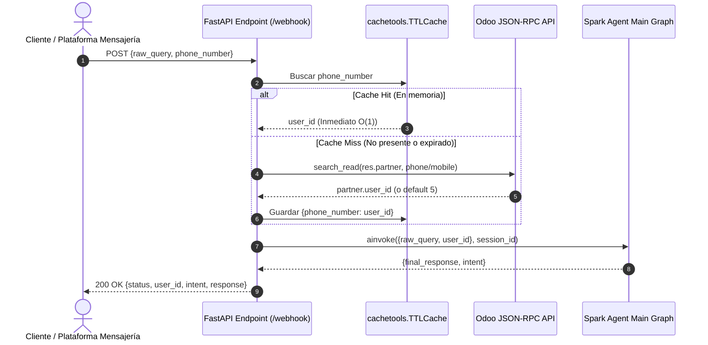

# Design: api-web-hook

## Context
Ver `proposal.md` para la motivación. Spark Agent dispone de un grafo modular en LangGraph (`src/agent_service/graph/main_graph.py`) y clientes Odoo (`src/agent_service/core/stores/product/odoo_client.py` y `src/agent_service/tools/contact_tools.py`), pero carece de un servidor HTTP/Webhook para exponer esta lógica a plataformas externas (como WhatsApp, Twilio, Meta Cloud API o bots omnicanal). Además, las consultas a Odoo sobre JSON-RPC tienen una latencia de red de 200 a 500 ms, por lo que resolver el `user_id` en cada mensaje sin caché impactaría negativamente el tiempo de respuesta total del agente conversacional.

## Goals / Non-Goals

**Goals:**
- Exponer una API Webhook asíncrona usando **FastAPI** y **Uvicorn**.
- Normalizar números de teléfono (limpieza de espacios, caracteres especiales, guiones, prefijos internacionales básicos).
- Consultar Odoo en `res.partner` buscando coincidencias en `phone` o `mobile` para obtener el `user_id` del comercial asignado.
- Implementar una caché en memoria usando `cachetools.TTLCache` con tamaño máximo (default `10,000`) y TTL configurable (default `3,600` segundos / 1 hora) para evitar llamadas redundantes a Odoo.
- Ejecutar el Grafo Principal `get_main_graph().ainvoke(...)` inyectando `user_id`, `raw_query` y `session_id` como `thread_id`.
- Proveer suite de pruebas unitarias exhaustivas con mocks de Odoo y validaciones de caché sin requerir servicios externos activos.

**Non-Goals:**
- No incluye proveedores específicos de mensajería (adaptadores propietarios de Twilio/Meta); el endpoint es agnóstico y estandarizado en formato JSON.
- No reemplaza la base de datos PostgreSQL de checkpoints ni la memoria a largo plazo; la caché de `cachetools` es exclusivamente para el mapeo rápido en memoria de `phone -> user_id`.

## Decisions

### 1. Framework Web: FastAPI sobre Flask o aiohttp
- **Decisión**: Utilizar `FastAPI` (junto con `uvicorn`).
- **Justificación**: Integración nativa con `asyncio`, compatibilidad con Pydantic v2 (que ya es la base del proyecto), validación automática de esquemas y generación de documentación OpenAPI interactiva.
- **Alternativas consideradas**: `aiohttp` puro (más bajo nivel y sin validación Pydantic nativa), `Flask` (requiere soporte síncrono o wrappers menos optimizados para Grafos LangGraph asíncronos).

### 2. Capa de Caché: `cachetools.TTLCache`
- **Decisión**: Utilizar `cachetools.TTLCache(maxsize=10000, ttl=3600)` encapsulado en un servicio `PhoneUserResolver`.
- **Justificación**: `cachetools` es una biblioteca estándar, probada y sin dependencias pesadas. La expiración por TTL garantiza que si un contacto cambia de vendedor en Odoo, la asignación se actualizará eventualmente tras la expiración del TTL.
- **Alternativas consideradas**: Redis distribuido (innecesariamente complejo para la etapa actual; agrega dependencias operacionales de infraestructura), `functools.lru_cache` (no soporta expiración por tiempo TTL nativamente).

### 3. Normalización de Teléfonos
- **Decisión**: Normalizar el número extrayendo dígitos (`re.sub(r"[^\d]", "", phone)`) y evaluando los últimos 9 dígitos para coincidencias en Perú/Latam o coincidencia exacta de formato internacional.
- **Justificación**: Los clientes y plataformas de mensajería frecuentemente envían números con prefijos internacionales (`+51`, `51`), espacios o guiones, mientras que en Odoo pueden estar registrados sin código de país o viceversa.

### 4. Flujo de Invocación del Agente
- **Decisión**: Inicializar el grafo una única vez a nivel de aplicación (singleton de FastAPI o lifespan) y reutilizar `get_main_graph()`.
- **Justificación**: Compilar el grafo en cada petición HTTP incurre en sobrecostos computacionales; compilarlo al inicio garantiza tiempos de respuesta mínimos.

### 5. Arquitectura Asíncrona No Bloqueante (Async/Await End-to-End)
- **Decisión**: Toda la cadena de ejecución en FastAPI debe ser 100% asíncrona (`async/await`), incluyendo el cliente HTTP asíncrono para Odoo (`httpx.AsyncClient`) y la ejecución del Grafo LangGraph (`ainvoke`).
- **Justificación**: FastAPI ejecuta los endpoints `async def` directamente en el event loop principal. Si se realizara alguna operación de I/O síncrona o bloqueante, se degradaría la concurrencia afectando a todos los usuarios de OpenClaw/WhatsApp.

## Risks / Trade-offs

- **[Riesgo] Asignación desactualizada en caché si un cliente cambia de vendedor en Odoo** → *Mitigación*: El TTL de 1 hora permite actualización periódica automática; se expone además una función o endpoint de limpieza manual de caché si se requiere forzar una recarga inmediata.
- **[Riesgo] Teléfonos registrados con formatos dispares en Odoo (+51 vs 9 dígitos)** → *Mitigación*: La búsqueda en Odoo utiliza operador `ilike` con los últimos 9 dígitos significativos del teléfono.
- **[Riesgo] Indisponibilidad temporal de Odoo durante un Cache Miss** → *Mitigación*: Bloque `try/except` que recurre de forma segura a `DEFAULT_USER_ID=5` registrando un log de advertencia sin cortar el servicio al usuario.
