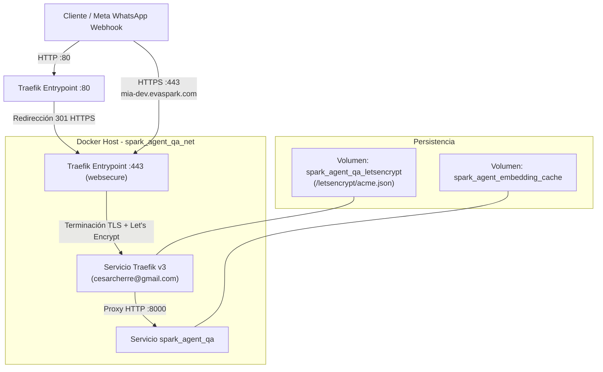

# Design: Traefik con Let's Encrypt para Entorno QA (`docker_compose.qa.yml`)

## Context

Actualmente `spark_agent` dispone de `docker_compose.dev.yml` para desarrollo local en puerto 2545. Para el entorno QA en el servidor, se necesita exponer el agente bajo el dominio público `mia-dev.evaspark.com` con cifrado HTTPS gestionado automáticamente por Traefik y Let's Encrypt registrado a nombre de `cesarcherre@gmail.com`.

Traefik es un reverse proxy nativo de Docker que lee dinámicamente etiquetas (`labels`) en los contenedores y maneja el ciclo de vida de los certificados SSL/TLS con Let's Encrypt sin necesidad de cronjobs manuales de certbot ni recargas de Nginx.

## Goals / Non-Goals

**Goals:**
- Configurar un archivo `docker_compose.qa.yml` autónomo.
- Configurar el servicio `traefik` con Traefik v3.1:
  - Puertos 80 y 443 expuestos.
  - Redirección global de HTTP a HTTPS.
  - Desafío TLS vía Let's Encrypt ACME con contacto `cesarcherre@gmail.com`.
  - Almacenamiento seguro del archivo `acme.json` en un volumen Docker persistente.
- Configurar el servicio `spark_agent`:
  - Enrutamiento por Host `mia-dev.evaspark.com`.
  - Carga de `.env.qa`.
  - Red puente compartida con Traefik (`spark_agent_qa_net`).
  - Conservación del volumen de caché de HuggingFace/embeddings.
- Generar plantilla `.env.qa.example` con los parámetros necesarios (`DOMAIN=mia-dev.evaspark.com`, `ACME_EMAIL=cesarcherre@gmail.com`, etc.).

**Non-Goals:**
- No exponer el dashboard de Traefik de forma pública sin autenticación (se mantiene deshabilitado o restringido).
- No modificar la configuración existente de desarrollo local (`docker_compose.dev.yml`).

## Decisions

### 1. Versión y Desafío de Let's Encrypt
- **Decisión:** Utilizar `traefik:v3.1` con TLS Challenge (`tlschallenge=true`) y correo de registro `cesarcherre@gmail.com`.
- **Justificación:** TLS-ALPN-01 permite a Let's Encrypt verificar la propiedad del dominio `mia-dev.evaspark.com` directamente en el puerto 443 sin requerir acceso a la API del proveedor DNS ni interferir con la redirección HTTP a HTTPS.

### 2. Persistencia de Certificados con Volumen Nombrado Docker
- **Decisión:** Emplear un volumen Docker nombrado (`spark_agent_qa_letsencrypt:/letsencrypt`) en lugar de un bind mount directo del host (`./letsencrypt/acme.json`).
- **Justificación:** Let's Encrypt y Traefik requieren estrictamente permisos `chmod 600` en `acme.json`. En sistemas Linux, los montajes tipo bind mount frecuentemente fallan o se corrompen si los permisos del archivo en el host no coinciden con el usuario del contenedor. Un volumen nombrado gestiona permisos de forma transparente y segura.

### 3. Red Docker Dedicada
- **Decisión:** Crear una red bridge específica `spark_agent_qa_net`.
- **Justificación:** Aísla el tráfico interno de QA entre Traefik y Spark Agent, permitiendo resolución interna por nombre de servicio (`spark_agent:8000`) sin exponer puertos de Spark Agent al host.

## Risks / Trade-offs

- **[Riesgo: Propagación DNS de `mia-dev.evaspark.com`]** → *Mitigación:* Para que Let's Encrypt emita el certificado exitosamente, el registro DNS tipo `A` de `mia-dev.evaspark.com` debe apuntar a la IP pública del servidor donde se ejecute el contenedor, y los puertos 80 y 443 deben estar abiertos en el firewall del servidor.
- **[Riesgo: Rate Limits de Let's Encrypt en pruebas iniciales]** → *Mitigación:* Se documenta el uso opcional del entorno de pruebas ACME staging de Let's Encrypt (`--certificatesresolvers.letsencrypt.acme.caserver=https://acme-staging-v02.api.letsencrypt.org/directory`) si se requiere depuración previa.
